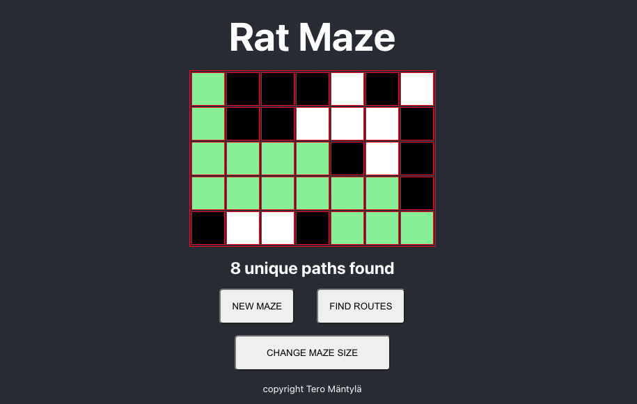

# Rat in a Maze

[test demo here](https://termanty.github.io/rat-maze/)

Rat in a Maze is a demo of path finding. Program uses Depth First Search algorithm to find all paths from top left corner to bottom right corner. Rat can only go right or left.
This app is assigment work in Datastructures course. The course is part of the Full Stack React program in [Helsinki Business College](https://hbc.fi/).

## Image of the app

